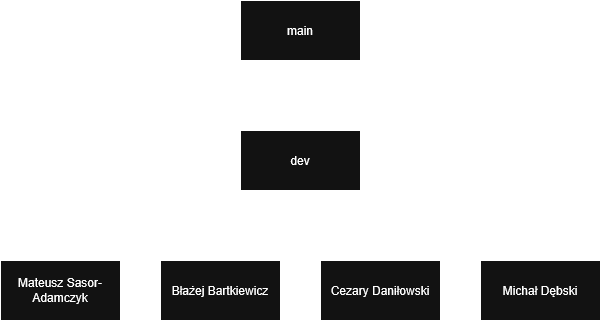

# TEG Project

## Table of Contents
- [General Concept](#general-concept)
- [Team Members](#team-members)
- [TODO](#todo)
- [Task Division](#task-division)
- [Git Structure](#git-structure)

## General Concept
The goal of the project is to create a multi-agent system handling player interactions with NPC characters based on a simple Unity demo. NPCs should be able to communicate both with the player and among themselves. Each NPC will play a specific role and provide the player only with information related to that role. Additionally, player interactions with one NPC should affect interactions with other NPCs.

## Team Members

Mateusz Sasor-Adamczyk,
Błażej Bartkiewicz,
Cezary Daniłowski,
Michał Dębski

## TODO

  
16.05.2025

  - [x] Fill out Jira
  - [x] Check if Python can be run from Unity
  - [x] Start the Python project
  - [x] Basic diagrams
  - [x] Create the concept of the city

  
20.05.2025

  - [x] Unity model
  - [x] Basic agent working in the console
  - [x] Create a manager to synchronize agent actions
  - [x] Create Unity-side API working with NPC models
  - [x] Create Python-side API working with the LLM
  - [x] Develop a PDF (or alternative) format for RAG for the LLM

  
03.06.2025

  - [x] Create a second agent and design interactions between them
  - [ ] Call methods from the LLM
  - [x] Develop method call scheme in Unity / equipment update transfer
  - [x] Multithreading for the pipe
  - [x] Agent testing
  - [x] Improve pipe communication with the LLM manager
  - [x] Run Python scripts from Unity
  - [x] Develop equipment system

  
08.06.2025

  - [x] Call methods from the LLM
  - [x] Encode/Decode messages via the pipe
  - [x] Improve UI controller communication with the pipe
  - [x] Manager updating local NPC equipment and player account status
  - [ ] Explore ways to streamline the RAG update process for the LLM
  - [x] Prepare presentation

  
22.06.2025

  - [ ] Log
  - [ ] Manager configuration
  - [ ] Prepare more complex use cases (without AI for now)
  - [ ] Clean up the code
  - [ ] English naming
  - [ ] Unify naming conventions

  
Next

  - [ ] Prepare presentation

## Task Division

| Sprint | Mateusz Sasor-Adamczyk | Błażej Bartkiewicz | Cezary Daniłowski | Michał Dębski |
| :--: | ------------------------ | ------------------ | ------------------ | -------------- |
| 1 | Fill out Jira | Start Python project | Basic diagrams | Create city concept |
| 1 | Check if Python can be run from Unity | | | |
| 2 | Create Unity-side API | Basic agent functionality | Develop PDF format (or alternative) for LLM RAG | Unity model |
| 2 | Create Python-side API | | Create the manager | |
| 3 | Call methods from LLM | Call methods from LLM | Call methods from LLM | Call methods from LLM |
| 3 | Multithreading for pipe | Agent testing | Develop method call/update equipment scheme in Unity | Develop equipment system |
| 3 | Improve pipe communication with LLM manager | Run Python script from Unity | Improve pipe communication with LLM manager | Run Python script from Unity |
| 4 | Call methods from LLM | Call methods from LLM | Call methods from LLM | Call methods from LLM |
| 4 | Encode/Decode messages via pipe | Explore ways to improve RAG update for LLM | Manager updating NPC equipment and player balance | Improve UI controller communication with pipe |
| 5 | Log | | Manager config | Next-day preparation (tavern) |
| 5 | Pipe – advanced use cases | | Manager prep for complex use cases | Equipment system for advanced cases |
| 5 | Rewrite README | | | |
| 5 | Standardize names | | | |
| 5 | Clean up code / English names | Clean up code / English names | Clean up code / English names | Clean up code / English names |

## Git Structure

- `main` – production environment with versions ready for presentation
- `dev` – development environment with integrated features
- `[named branches]` – individual environments where each team member implements specific features

